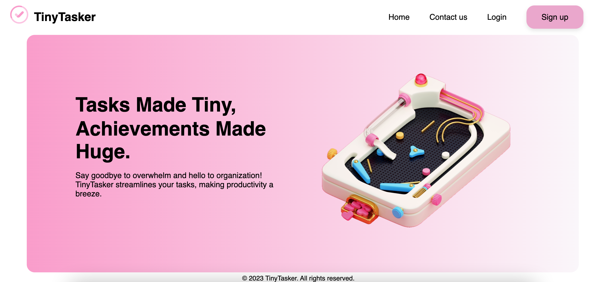

# TinyTasker

TinyTasker is a simple and intuitive project/task management web application designed to help you organize your work efficiently. Whether you're working solo or collaborating with a team, TinyTasker provides the tools you need to streamline your workflow.

## Features

- **Task Management:** Create, edit, and delete tasks with ease.
- **Project Organization:** Group tasks into projects for better organization.
- **User-Friendly Interface:** Enjoy a clean and intuitive user interface for a seamless experience.
- **Collaboration:** Collaborate with team members, assign tasks, and track progress.
- **Customizable:** Adapt TinyTasker to your workflow with customizable features.

## About

This project was developed as part of the group project for the Web Development Atelier at the Higher National School of Engineers (ENSIT).